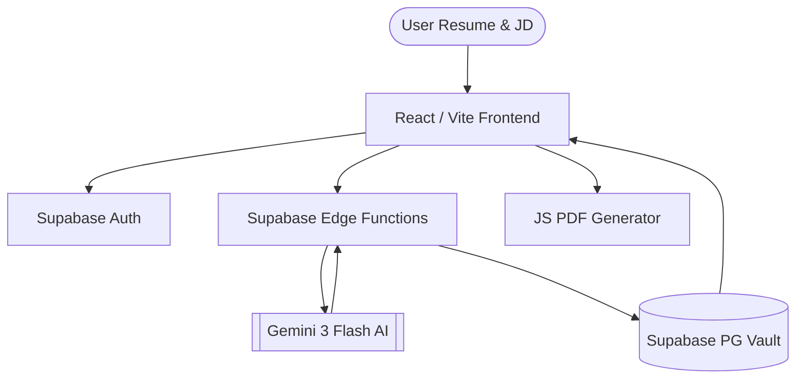

<div align="center">

# 💎 Lumina JD
### AI-Powered ATS Optimization Engine & Career Strategist

[](https://lumina-jd-scanner-main.vercel.app/)
[](https://ai.google.dev/)
[](https://supabase.com/)
[](LICENSE)

<div align="center">
  
</div>

**Lumina JD** is a comprehensive resume screening weapon designed to move job seekers from "average applicant" to **ATS-certified, interview-ready**. Built with a pristine **OpenAI Minimalist** aesthetic and Apple iOS Glassmorphism, it leverages Gemini 3 Flash to deconstruct complex Job Descriptions into actionable data and automatically generate market-winning resumes.

[**Explore the Live App →**](https://lumina-jd-scanner-main.vercel.app/)

</div>

---

## ✨ The Core Experience

Lumina JD isn't just a scanner; it's a **Career Strategist** designed for the modern job market.

### 🎨 Design Philosophy: Luxury Liquid Glass
- **Dual-Surfaced UI:** Switch between **Executive Light (Warm Paper)** and **Deep Obsidian (Warm Zinc)**, optimized for high-density information reading.
- **Glassmorphism 2.0:** Utilizing heavy backdrop blurs and specular edge highlights to create a premium, native-app feel within the browser.
- **Motion Orchestration:** Powered by Framer Motion, every interaction—from skill expansion to Kanban moves—is smooth and intentional.

### 🛠️ Key Engine Modules

| Module | Capability | Value |
| :--- | :--- | :--- |
| **🔍 AI Skill Decoder** | Deep extract of category-wise requirements | Zero-miss requirement mapping |
| **🔑 ATS Keyword Scanner** | Live coverage % analysis against JD | Beat the initial ATS screen |
| **📊 Match Simulator** | Pass/Fail verdict with point-deductions | Know your odds before applying |
| **🛡️ Bullet Architect** | AI-generated technical justifications | Instant resume deficiency fixes |
| **📝 PDF Resume Gen** | One-click, single-column ATS-clean export | Professional formatting guaranteed |
| **📋 Career Kanban** | Dedicated pipeline for application tracking | Stay organized across 100+ roles |

---

---

## 🧠 AI Intelligence & Semantic Logic

As an AI-first platform, Lumina JD employs advanced prompt engineering and data extraction patterns to ensure accuracy and strategic depth.

### 🔬 High-Fidelity Extraction
The engine uses **Gemini 3 Flash** with a system-level instruction set that mimics a Senior Technical Recruiter.
- **Semantic OR-Logic:** Intelligently detects required alternatives (e.g., "React OR Angular") to prevent penalizing candidates who meet at least one criterion.
- **Importance Weighting:** Calculates a dynamic `0-100` importance score for every skill based on JD context and frequency.
- **Deterministic Scoring:** Implements a custom caching layer to ensure identical JDs return consistent, reproducible scores.

### 🏆 The "Top 0.1%" Winning Strategy
Beyond simple keyword matching, Lumina generates 3 unique, actionable steps for every role:
1. **Gap Specificity:** Identifies the exact technical delta between your resume and the JD.
2. **Actionable Justification:** Provides AI-written bullet points that quantify your experience relative to the missing skills.
3. **Market Alignment:** Analyzes broader industry trends to suggest project-based bridge-building strategies.

### 📊 Data Science Methodology
The platform treats every Job Description as a semi-structured dataset.
- **NLP Pipeline:** Tokenization and entity recognition to isolate tech-stacks from fluff.
- **Heuristic Matching:** Cross-references extracted skills against a normalized taxonomy to handle variations (e.g., "TS" mapping to "TypeScript").
- **Quality Assurance:** Automated consistency tests (see `test_consistency.js`) ensure the AI output stays within expected structural bounds.

---

## 🏗️ System Architecture



## 🛠️ Tech Stack

### Frontend & Design
- **Core:** React 18, TypeScript, Vite
- **Ui/UX:** Shadcn UI, Radix Primitives, Tailwind CSS
- **Animations:** Framer Motion (Liquid Motion), Lucide Icons
- **State:** TanStack Query (React Query)

### AI & Intelligence
- **LLM:** Google Gemini 3 Flash (Primary), Gemini 1.5 Pro (Strategy)
- **Integration:** Supabase Edge Functions (Deno Runtime)
- **Logic:** Custom Semantic Mapping & ATS Match Algorithms

### Infrastructure & DevOps
- **Backend:** Supabase (Auth, PostgreSQL, Realtime)
- **Deployment:** Vercel (Production Edge Network)
- **Testing:** Playwright (E2E), Vitest (Unit)

---

## 🚀 Setup & Launch

1. **Clone & Install:**
   ```bash
   git clone https://github.com/Amruth011/lumina-jd-scanner.git
   cd lumina-jd-scanner
   npm install
   ```
2. **Environment Configuration:** Create a `.env` file with your Supabase and Gemini keys.
3. **Run Dev Server:**
   ```bash
   npm run dev
   ```

---

## 🤝 Contributing & Vision

Created by **Amruth Kumar M**, an AI & Data Science student at Reva University. 

**Roadmap 2026:**
- [ ] Multi-document Resume Comparison
- [ ] LinkedIn Profile URL Optimization
- [ ] Real-time Mock Interview Simulator based on JD

* **GitHub:** [@Amruth011](https://github.com/Amruth011)
* **Instagram:** [@assuredtechfuture](https://www.instagram.com/assuredtechfuture)
* **LinkedIn:** [Connect with Amruth](https://www.linkedin.com/in/amruthkumarm/)

---
<div align="center">
<i>Lumina JD: Turn every Job Description into a Job Offer.</i>
</div>
