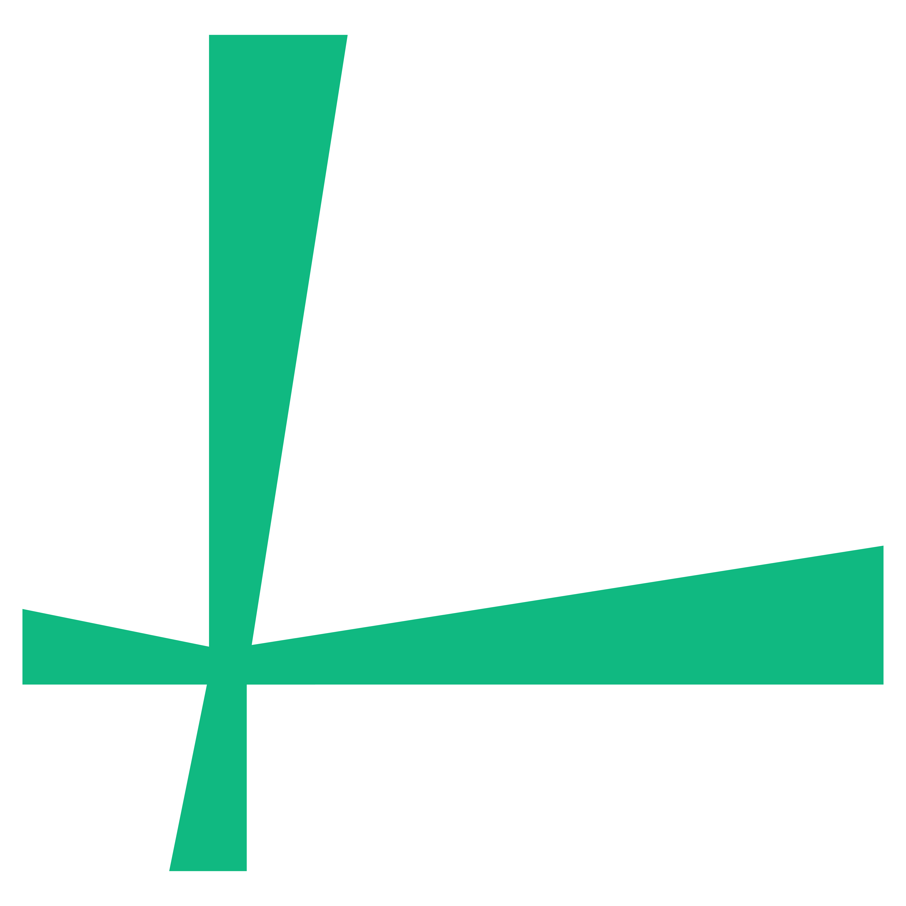
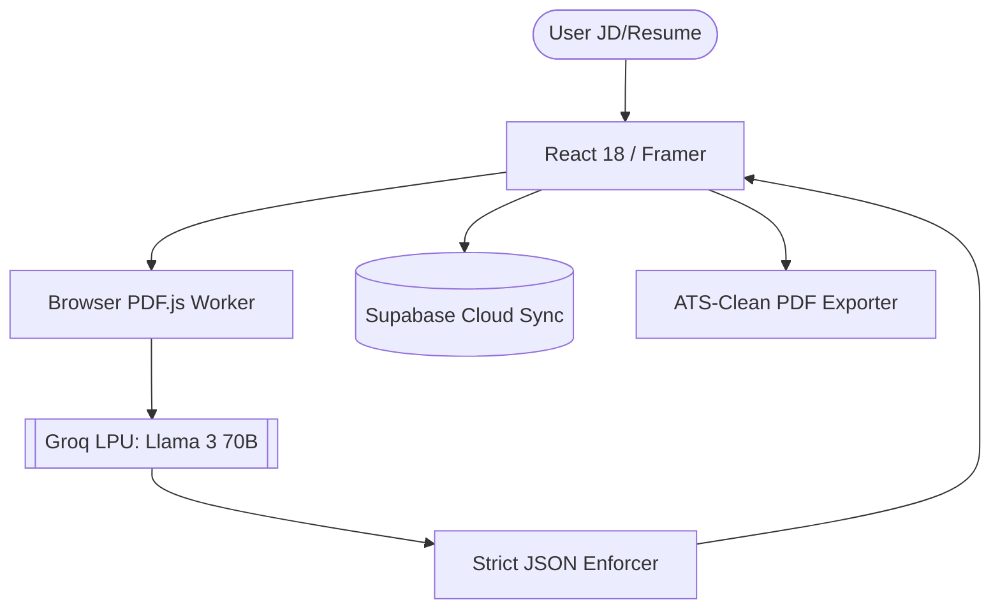

<div align="center">

# 
### Silicon Valley Standard • Ultra-Low Latency • 100% Reliable

[](https://lumina.app/)
[-orange?style=for-the-badge&logo=meta)](https://groq.com)
[](https://react.dev/)
[](LICENSE)

**Lumina** is a high-performance career optimization platform designed to move job seekers into the top 1% of applicants. Built with a pristine **Luxury Liquid Glass** aesthetic and powered by ultra-low-latency Groq inference, it deconstructs complex Job Descriptions and perfectly structures your resume data to uncover your competitive advantage.

[**Launch Terminal →**](https://lumina.app/)

</div>

---

## 🛡️ Engineered for Speed & Stability: The Groq Migration
Lumina recently underwent a complete architectural overhaul...

- **Groq LPU Processing**: Powered by `llama-3.3-70b-versatile` on Groq's hardware, delivering near-instantaneous token generation.
- **Client-Side AI Inference**: Bypasses slow serverless edge functions entirely. The browser talks directly to the AI, ensuring zero timeout errors and bypassing Vercel execution limits.
- **Strict JSON Output Enforcement**: Llama 3 combined with Groq's `json_object` enforcement mathematically guarantees 100% consistent data structure every single time, without relying on unstable text scrapers.
- **Native Browser PDF Parsing**: Utilizes Vite URL bundling and `pdfjs-dist` to securely parse and extract resume text entirely within the user's browser, eliminating external server memory crashes.

---

## ✨ The Lumina Experience

### 🎨 Design Philosophy: Liquid Obsidian
- **Glassmorphism 2.0:** Deep zinc backdrops, backdrop-blur saturation, and sub-pixel edge highlights.
- **Editorial Typography:** A curated hierarchy of *Instrument Serif* for headings and *Inter* for surgical-grade body text.
- **Compact UI/UX:** Responsive, dense, matrix-style data dashboards tuned for professional analytics.

### 🛠️ Strategic Modules

| Capability | Technical Implementation | Core Value |
| :--- | :--- | :--- |
| **🔍 Master Vault Sync** | Full Page Context Extraction | Pulls Name, Timeline, Edu, and Projects instantly |
| **🎯 Resume Gap Analyzer** | Multi-vector Semantic Comparison | Identify the exact 0.1% delta and missing skills |
| **🏗️ Tailored Gen Engine** | 70B Parameter Llama Generation | AI-written bullets that land interviews perfectly matched |
| **🛡️ Dynamic Data Vault** | Local-First + Supabase Sync | Never lose your progress with dynamic entry forms |
| **📑 ATS PDF Exporter** | Single-Column Semantic Renderer | Guaranteed to pass any ATS reader with zero formatting loss |

---

## 🏗️ Architecture & Stack



### The Tech Stack
- **Frontend:** React 18, TypeScript, Vite, Tailwind CSS (Glassmorphism)
- **AI Intelligence:** Meta Llama 3 70B via Groq API (Instantaneous Generation)
- **Data Layer:** Supabase (Auth, Postgres, Realtime Sync)
- **Document Processing:** PDF.js (Client-side worker thread parsing via Vite Assets)
- **Deployment:** Vercel Global Edge Network

---

## 🚀 Getting Started

1. **Deployment URL:** [lumina.app](https://lumina.app/)
2. **Local Setup:**
   ```bash
   git clone https://github.com/Amruth011/lumina.git
   npm install
   npm run dev
   ```

---

## 🤝 The Vision

Created by **Amruth Kumar M**
Lumina is designed to bridge the gap between technical brilliance and the modern ATS-driven hiring machine.

* **GitHub:** [@Amruth011](https://github.com/Amruth011)
* **Instagram:** [@assuredtechfuture](https://www.instagram.com/assuredtechfuture)
* **LinkedIn:** [Amruth Kumar M](https://www.linkedin.com/in/amruthkumarm/)

---
<div align="center">
<i>"Lumina: Where engineering excellence meets career strategy."</i>
</div>


