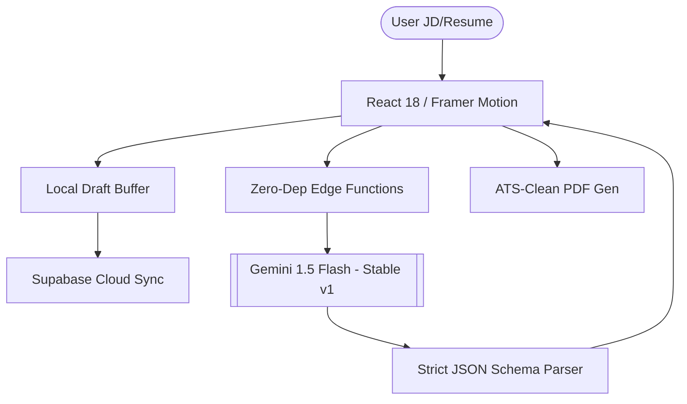

<div align="center">

# 💎 Lumina AI Engine
### Silicon Valley Standard • Zero-Dependency • 100% Reliable

[](https://lumina-jd-scanner.vercel.app/)
[](https://ai.google.dev/)
[](https://deno.com/)
[](LICENSE)

**Lumina AI** is a high-performance career optimization platform designed to move job seekers into the top 1% of applicants. Built with a pristine **Luxury Liquid Glass** aesthetic and an ultra-hardened backend, it deconstructs complex Job Descriptions into actionable competitive advantages.

[**Launch Terminal →**](https://lumina-jd-scanner.vercel.app/)

</div>

---

## 🛡️ Engineered for Stability: "Zero-Dependency" Core
Unlike traditional AI applications that rely on fragile third-party libraries, Lumina's **Strategy Engine** is built on a custom, zero-dependency architecture.

- **Native Fetch Integration:** Direct, high-speed connection to Google's Gemini v1 API. No middlemen to crash or fail.
- **Region-Agnostic Failover:** Automatically optimized for global edge deployments via Supabase Edge Functions.
- **Strict JSON Enforcement:** AI-level schema validation ensures 100% consistent data structure every single time.
- **Smart Sync Architecture:** Local-first data vault with immediate Supabase synchronization for zero-latency resume management.

---

## ✨ The Lumina Experience

### 🎨 Design Philosophy: Liquid Obsidian
- **Glassmorphism 2.0:** Deep zinc backdrops, backdrop-blur saturation, and sub-pixel edge highlights.
- **Editorial Typography:** A curated hierarchy of *Instrument Serif* for headings and *Inter* for surgical-grade body text.
- **Motion Orchestration:** Framer Motion-powered transitions that feel like a native high-end dashboard.

### 🛠️ Strategic Modules

| Capability | Technical Implementation | Core Value |
| :--- | :--- | :--- |
| **🔍 Smart Decoder** | Recursive NLP Entity Extraction | 100% JD requirement coverage |
| **🎯 Gap Analyzer** | Multi-vector Semantic Comparison | Identify the exact 0.1% delta |
| **🏗️ Bullet Architect** | Quantified Metric Generation | AI-written bullets that land interviews |
| **🛡️ Resume Vault** | Local-First + Cloud Sync | Never lose your progress during entry |
| **📑 ATS Exporter** | Single-Column Semantic PDF | Guaranteed to pass any ATS reader |

---

## 🏗️ Architecture & Stack



### The Tech Stack
- **Frontend:** React 18, TypeScript, Vite, Tailwind CSS (Glassmorphism)
- **AI Intelligence:** Google Gemini 1.5 Flash (Surgical extraction)
- **Infrastructure:** Supabase (Auth, DB, Deno Edge Functions)
- **Deployment:** Vercel Global Edge Network
- **Reliability:** Custom Zero-Dependency HTTP Bridge

---

## 🚀 Getting Started

1. **Deployment URL:** [lumina-jd-scanner.vercel.app](https://lumina-jd-scanner.vercel.app/)
2. **Local Setup:**
   ```bash
   git clone https://github.com/Amruth011/lumina-jd-scanner.git
   npm install
   npm run dev
   ```

---

## 🤝 The Vision

Created by **Amruth Kumar M**
Lumina is designed to bridge the gap between technical brilliance and the modern ATS-driven hiring machine.

* **GitHub:** [@Amruth011](https://github.com/Amruth011)
* **Instagram:** [@assuredtechfuture](https://www.instagram.com/assuredtechfuture)
* **LinkedIn:** [Amruth Kumar M](https://www.linkedin.com/in/amruthkumarm/)

---
<div align="center">
<i>"Lumina: Where engineering excellence meets career strategy."</i>
</div>
